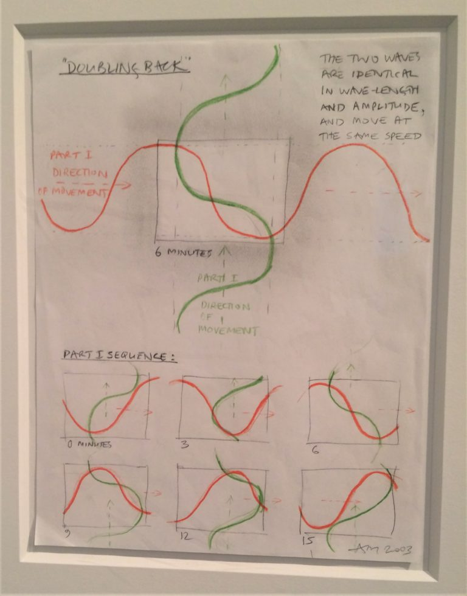

# Description

The idea of this repo is to make a macOS screensaver out of my [solid-light-works](https://github.com/taylorjg/solid-light-works) repo which is an attempt to render some of Anthony McCall's solid light works using three.js and WebGL.
I intend to write the screensaver in Swift using Metal. 

# Basic Screensaver

The first step was to create a basic macOS screensaver in Swift using Metal. This has not been easy. I have not been able to find much in the way of examples. I did the following:

* Created a project using the `Screen Saver` template
* Removed the Objective-C files and added a Swift file (`SolidLightWorksView.swift`) as per [How to Make a Custom Screensaver for Mac OS X](https://medium.com/better-programming/how-to-make-a-custom-screensaver-for-mac-os-x-7e1650c13bd8)
* Added a new target based on the `Cross-platform` template choosing Swift and Metal
  * I would have used the `App` template but I am running XCode 11.3 on macOS 10.14.4 and I found that if I created an App with a User Interface of type SwiftUI, I could not run it because it required macOS 10.15.
* Hacked away at `SolidLightWorksView.swift` based on `GameViewController.swift`
* Started the process of debugging to figure out why the screensaver wasn't working and how to fix it

## Debugging the Screensaver

In order to debug my screensaver, I did something horrible but effective - I used `NSAlert` as a logging mechanism e.g.:

```
let alert = NSAlert()
alert.informativeText = "Unable to load texture. Error info: \(error)"
alert.addButton(withTitle: "OK")
alert.runModal()
```

This allowed me to pinpoint where the problem was occurring. The call to `device.makeDefaultLibrary()` was returning `nil`.
I figured out this was a bundling issue - the main bundle was for `/Applications/System Preferences.app` rather than my screensaver's bundle. I fixed this by explicltly loading my bundle using [`init(for:)`](https://developer.apple.com/documentation/foundation/bundle/1417717-init).

```
let bundle = Bundle(for: SolidLightWorksView.self)
```

# TODO

I have only just started this project. At the moment, all I have done is take the code generated by the  `Cross-platform` Swift/Metal template and get it working as a screensaver. Hence, everything else is still to do.

* ~~Draw screen~~
* ~~Draw axes~~
* ~~Port [three-line-2d](https://github.com/mattdesl/three-line-2d) to Metal~~
* ~~Draw a static wave~~
* ~~Draw a travelling wave~~
* ~~Implement first of the forms (without membrane): Doubling Back~~
* ~~Draw the remaining vocabulary: ellipse, line, circle wave~~
* ~~Implement the remaining forms (without membrane)~~
* ~~Periodically switch between forms~~
* Port the membrane geometry to Metal
* Implement first of the forms (with membrane): Doubling Back
* Implement the remaining forms (with membrane)
* Randomly switch between camera positions
* Implement camera lookat
* Implement rotating camera
* Add a screensaver configuration sheet with option to show forms without membranes

# Maths

Here are a few notes regarding the maths behind the forms.

Anthony McCall talks about a vocabulary of forms (see [Notebooks and Conversations](https://www.amazon.co.uk/Anthony-McCall-Graham-Ellard/dp/184822169X) pp. 171-172):

* the Circle
* the Straight Line
* the Travelling Wave
* the Wipe
* the Circle Wave

## Doubling Back

Two travelling waves travelling in opposite directions - one of them to the right and the other upwards.
I used the following reference for details of an equation for a travelling wave:

* [Traveling waves](http://labman.phys.utk.edu/phys221core/modules/m11/traveling_waves.html)

See [Notebooks and Conversations](https://www.amazon.co.uk/Anthony-McCall-Graham-Ellard/dp/184822169X) p. 85.


## Coupling

Two circle waves. I found the following blog article that provides more details including equations:

* [Making of Solid Light for Anthony McCall](https://www.ericforman.com/blog/making-of-solid-light-for-anthony-mccall)

## Between You and I

Ellipses, straight lines and travelling waves. The rotating straight line needs to be clipped to a rectangle. I used the following reference to do this:

* [Cohen–Sutherland algorithm](https://en.wikipedia.org/wiki/Cohen%E2%80%93Sutherland_algorithm)

## Leaving

I think this is a travelling wave along the radius of an ellipse which rotates clockwise around the ellipse.
The tricky part was figuring out the point of intersection between the rotating travelling wave and the path of the ellipse.
I used the following references to achieve this:

* [Newton's method / Newton–Raphson method](https://en.wikipedia.org/wiki/Newton%27s_method)
* [How to find the intersection of two curves](https://uk.mathworks.com/matlabcentral/answers/318475-how-to-find-the-intersection-of-two-curves#answer_249066)

# Links

* [How to Make a Custom Screensaver for Mac OS X](https://medium.com/better-programming/how-to-make-a-custom-screensaver-for-mac-os-x-7e1650c13bd8)
* Apple Documentation
  * [ScreenSaver](https://developer.apple.com/documentation/screensaver)
    * [ScreenSaverView](https://developer.apple.com/documentation/screensaver/screensaverview)
    * [ScreenSaverDefaults](https://developer.apple.com/documentation/screensaver/screensaverdefaults)
* Books
  * [Notebooks and Conversations](https://www.amazon.co.uk/Anthony-McCall-Graham-Ellard/dp/184822169X)
* [solid-light-works](https://github.com/taylorjg/solid-light-works)
